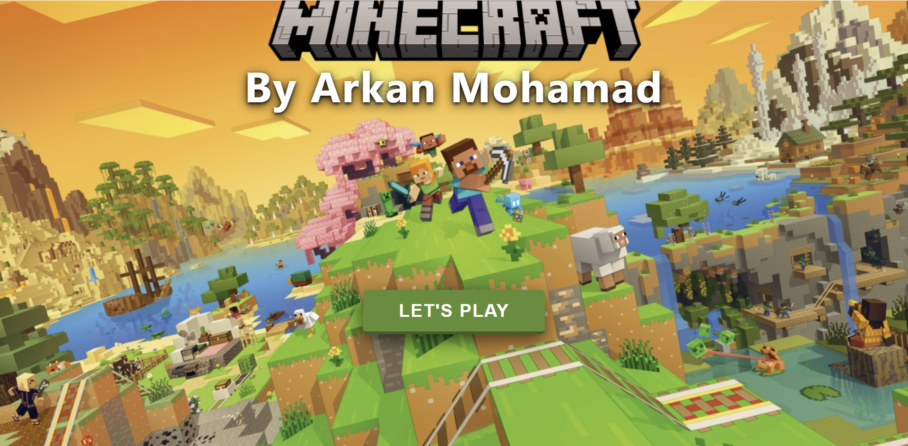
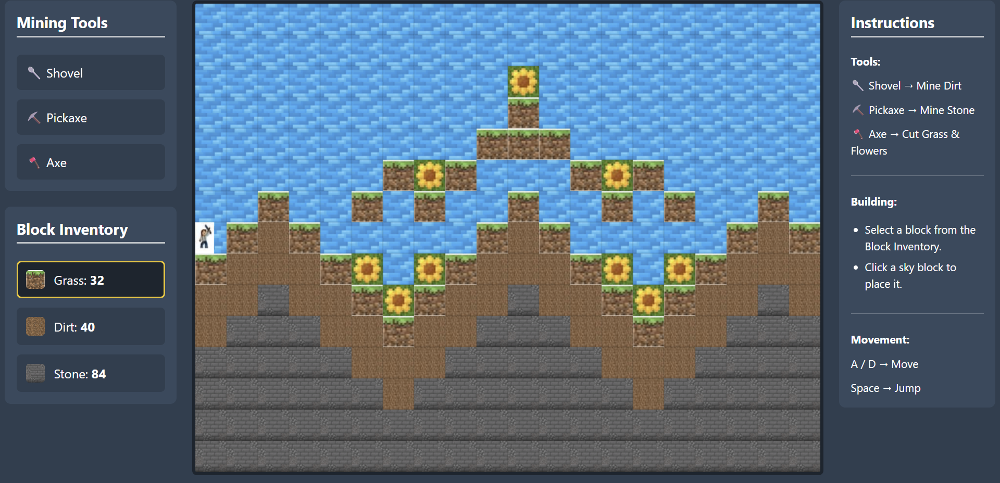
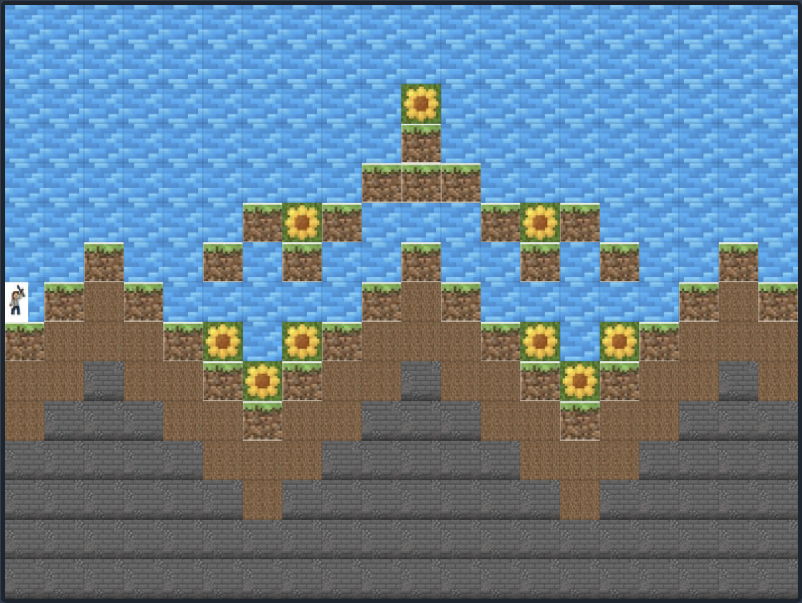
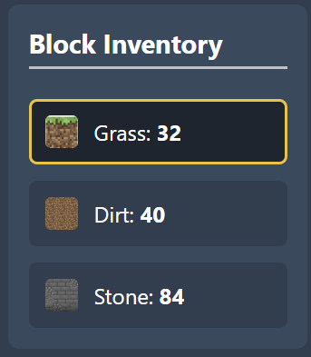
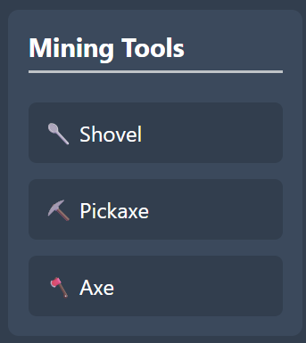
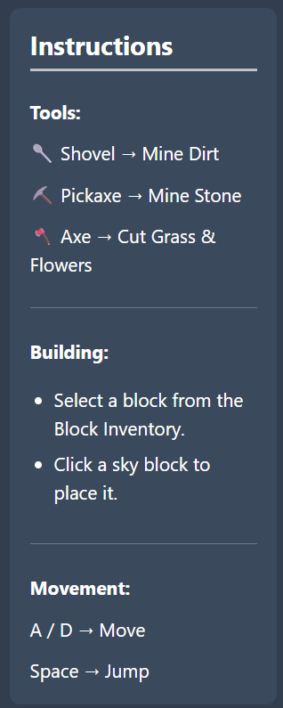

# ⛏️ 2D Minecraft Grid Game






A **2D Minecraft-inspired sandbox game** built using **HTML, CSS, and JavaScript Canvas**.

This project recreates a block-based world where the player can explore, move through the terrain, mine different blocks using specialized tools, and build structures using available blocks.

The main goal of this project was to practice core **game development concepts** and build a modular JavaScript application.

---

# 🎮 About The Game

The player enters a Minecraft-style 2D world made of different blocks.

The gameplay loop is:

```
Explore → Mine Resources → Collect Blocks → Build Structures
```

The game includes:

- A generated block world.
- Player movement and physics.
- Mining mechanics.
- Building system.
- Block inventory.
- Different tools for different block types.

---

# ✨ Features

## 🌍 Block-Based World

The world is created using a grid system containing different block types:

| Block | Description |
|------|-------------|
| 🌱 Grass | Main surface terrain |
| 🟫 Dirt | Diggable ground blocks |
| 🪨 Stone | Hard blocks requiring a pickaxe |
| ☁️ Sky | Empty space for movement and building |
| 🌸 Flowers | Decorative blocks removed using an axe |

---

# 🧍 Player System

The player can:

- Move left and right.
- Jump using physics-based movement.
- Walk on different blocks.
- Collide with the environment.
- Interact with the world.

## Controls

```
A / D  → Move Left & Right

Space → Jump
```

---

# ⛏️ Mining System

The game includes different tools, each designed for specific blocks:

| Tool | Function |
|------|----------|
| 🥄 Shovel | Mines dirt blocks |
| ⛏️ Pickaxe | Mines stone blocks |
| 🪓 Axe | Removes grass and flowers |

The tool system demonstrates interaction between the player and the block environment.

---

# 🎒 Block Inventory

The inventory allows the player to select blocks and use them for building.

Available blocks:

- 🌱 Grass
- 🟫 Dirt
- 🪨 Stone

Selected blocks can be placed inside the game world.

---

# 🏗️ Building System

Players can create structures by placing blocks in empty spaces.

### How To Build:

```
1. Select a block from the Block Inventory.

2. Click on an empty sky block.

3. The block will be placed into the world.
```

Example:

```
Select Block → Click Empty Space → Build
```

---

# 🖼️ Game Screenshots

## Main Game World



## Block Inventory




## Mining System




## Instructions



---

# 📁 Project Structure

```
2D-Minecraft
│
├── src
│   │
│   ├── core
│   │   ├── app.js
│   │   └── grid.js
│   │
│   └── entities
│       ├── blockManager.js
│       └── player.js
│
├── index.html
├── style.css
└── README.md
```

---

# 🧩 Project Architecture

The project is organized into separate modules to keep the code clean and maintainable.

### app.js

Responsible for:

- Starting the game.
- Running the main game loop.
- Handling canvas rendering.

### grid.js

Responsible for:

- Creating the game world.
- Managing the block grid.
- Handling terrain structure.

### player.js

Responsible for:

- Player movement.
- Gravity.
- Jumping.
- Collision detection.

### blockManager.js

Responsible for:

- Managing blocks.
- Mining logic.
- Block placement.

---

# 🛠️ Technologies Used

- HTML5
- CSS3
- JavaScript ES6
- Canvas API

---

# 🚀 How To Run

## Option 1: Using VS Code Live Server

1. Clone the repository:

```bash
git clone https://github.com/ArkanMohammad/2D-Minecraft.git
```

2. Open the project in VS Code.

3. Install the **Live Server** extension.

4. Open:

```
index.html
```

5. Right click and select:

```
Open with Live Server
```

---

## Option 2: Open Directly

Open:

```
index.html
```

directly in your browser.

---

# 🎯 Learning Objectives

Through this project, I practiced:

- Building interactive games using Canvas API.
- Creating a real-time game loop.
- Implementing gravity and collision detection.
- Managing objects and game entities.
- Structuring JavaScript into reusable modules.
- Handling user input and interactions.

---

# 🔮 Future Improvements

Possible future improvements:

- 🌳 Add trees and more terrain generation.
- 🐮 Add animals and NPC characters.
- 🎒 Create a complete inventory system.
- 💾 Add save and load worlds.
- 🔊 Add sound effects.
- ✨ Add mining and building animations.
- 👾 Add enemies and survival mode.

---

# 👨‍💻 Author

**Arkan Mohammad**

Software Engineering Graduate | Front-End Developer

Passionate about building interactive web applications with clean and maintainable code.

GitHub:

https://github.com/ArkanMohammad